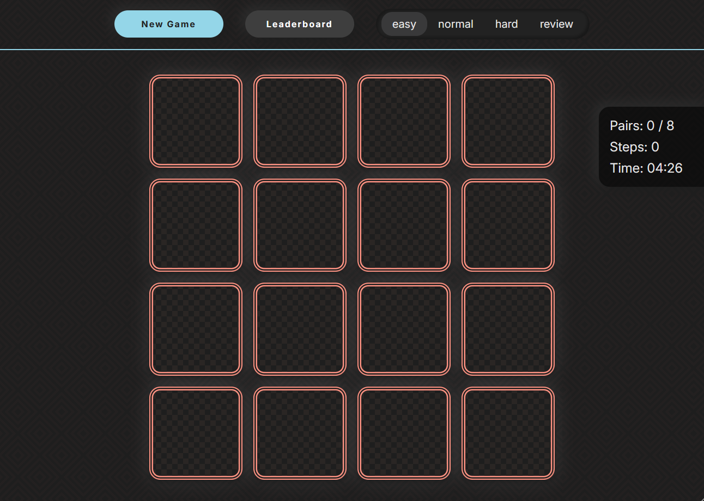

# README.md

# Memory Game — Week Edition

Игра на поиск пар: игрок открывает карточки и запоминает их расположение, чтобы найти все совпадения за наименьшее число ходов.

## Описание

На игровом поле 16 карточек — 8 пар с одинаковыми изображениями. В начале игры все карточки лежат рубашкой вверх. Игрок последовательно открывает по две карточки:

- если изображения совпали — карточки остаются открытыми, счётчик найденных пар увеличивается;
- если изображения различаются — карточки закрываются через 700–1500 мс, а ход засчитывается.

Игра завершается, когда найдены все 8 пар. После победы автоматически открывается модальное окно с итоговым количеством ходов и кнопками «Новая игра» и «Закрыть».

Результаты сохраняются в `localStorage` и доступны в таблице лидеров (до 10 лучших результатов).

## Ссылки

- **Задание:** [Memory Game — Week Edition](https://github.com/dashque/tasks/blob/1395fbdb3e10388bd2a835549de3b2d31bb60a05/tasks/memory-game-week-edition/README.md)
- **Деплой:** [Demo](https://shishkinsa997.github.io/memory-game/)
- **Pull Request:** [Memory Game](https://github.com/shishkinsa997/memory-game/pull/1)
- **Требования:** [Requirements](requirements.md)

## Скриншот



## Локальный запуск

### Необходимые условия

- Node.js (версия 18 или выше)
- Любой современный браузер (Chrome, Firefox, Edge, Safari)

### Установка зависимостей

```bash
npm install
```

### Запуск

```bash
npm run dev
```

### Сборка (при необходимости)

```bash
npm run build
```

## Технологии

- HTML5
- CSS3, SCSS
- JavaScript (ES6+), DOM API
- Vite
- `localStorage` для хранения результатов

## Структура проекта

```
memory-game/
├── index.html
├── package.json
├── public
|  └── favicon.ico
├── README.md
├── requirements.md
├── src
|  ├── js
|  |  ├── components
|  |  |  ├── Card.js
|  |  |  ├── Counters.js
|  |  |  ├── GameField.js
|  |  |  ├── GameOver.js
|  |  |  ├── Header.js
|  |  |  ├── Leaderboard.js
|  |  |  ├── Modal.js
|  |  |  └── NewGameBtn.js
|  |  ├── main.js
|  |  ├── screens
|  |  |  └── GameScreen.js
|  |  ├── state.js
|  |  ├── svgCards
|  |  |  ├── cards.data.js
|  |  |  ├── cards.js
|  |  |  ├── convert-icons.mjs
|  |  |  └── renderIcon.js
|  |  └── utils
|  |     ├── getNumberOfCards.js
|  |     ├── getRandom.js
|  |     └── utils.js
|  └── styles
|     ├── card.scss
|     ├── counters.scss
|     ├── game-field.scss
|     ├── header.scss
|     ├── main.scss
|     ├── modal.scss
|     ├── _mixins.scss
|     └── _variables.scss
└── vite.config.js
```

## Функциональность

- Генерация всего интерфейса через JavaScript (в `<body>` только тег `<script>`).
- Перемешивание карточек при запуске и каждой новой игре (алгоритм рандомизации).
- Открытие двух карточек за ход, блокировка поля при открытой несовпавшей паре.
- Счётчики ходов и найденных пар (0 ходов, 0 из 8 пар в начале).
- Модальное окно победы с итоговым числом ходов.
- Таблица лидеров: топ-10 результатов с местами, ходами и датами в формате ДД.ММ.ГГГГ.
- Сохранение результатов в `localStorage`, без дублирования.
- Кнопка «Новая игра» в хедере и в окне победы: сброс таймера, перемешивание, обнуление счётчиков.
- Закрытие модальных окон кнопкой, кликом по фону и клавишей Escape.
- Блокировка прокрутки страницы при открытом модальном окне.

## Самооценка

**Итого: 105 / 100**

| Критерий                           | Баллы   | Комментарий                                              |
| ---------------------------------- | ------- | -------------------------------------------------------- |
| Генерация разметки                 | 15 / 15 | Весь интерфейс создан через JavaScript                   |
| Игровое поле и начальное состояние | 10 / 10 | 8 пар, все карточки закрыты, счётчики 0                  |
| Перемешивание                      | 5 / 5   | Алгоритм рандомизации при каждом запуске                 |
| Открытие карточек и совпадения     | 15 / 15 | Первая карточка остаётся открытой, совпавшие фиксируются |
| Несовпавшие пары                   | 10 / 10 | Закрытие через 1000 мс, блокировка выбора                |
| Счётчики                           | 5 / 5   | Ход за две карточки, пара за совпадение                  |
| Окно победы и модальные окна       | 15 / 15 | Автооткрытие, затемнение, Escape, клик по фону           |
| Таблица лидеров                    | 10 / 10 | Топ-10, сортировка, localStorage                         |
| Новая игра                         | 15 / 15 | Сброс таймера, перемешивание, обнуление                  |
| README                             | 5 / 5   | Описание, ссылки, инструкция запуска                     |

## Даты

- **Дата сдачи:** 06.10.2026
- **Дедлайн:** 06.10.2026
